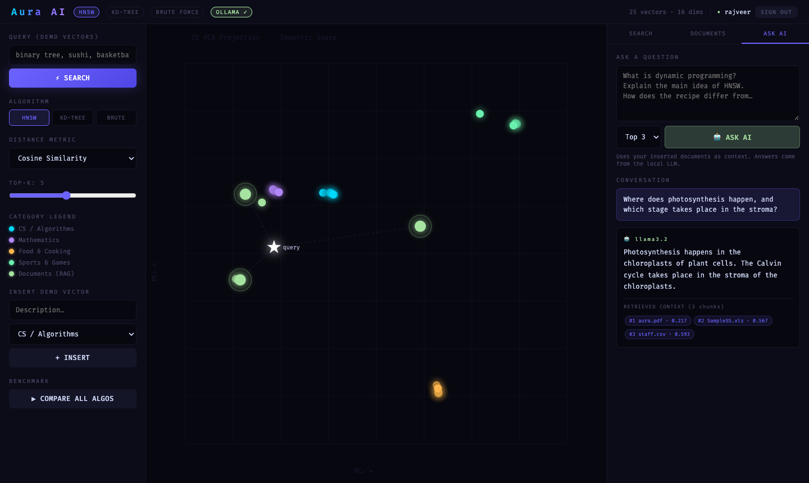
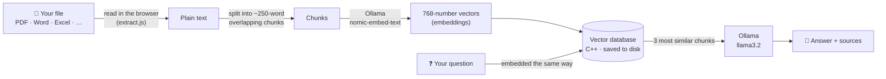
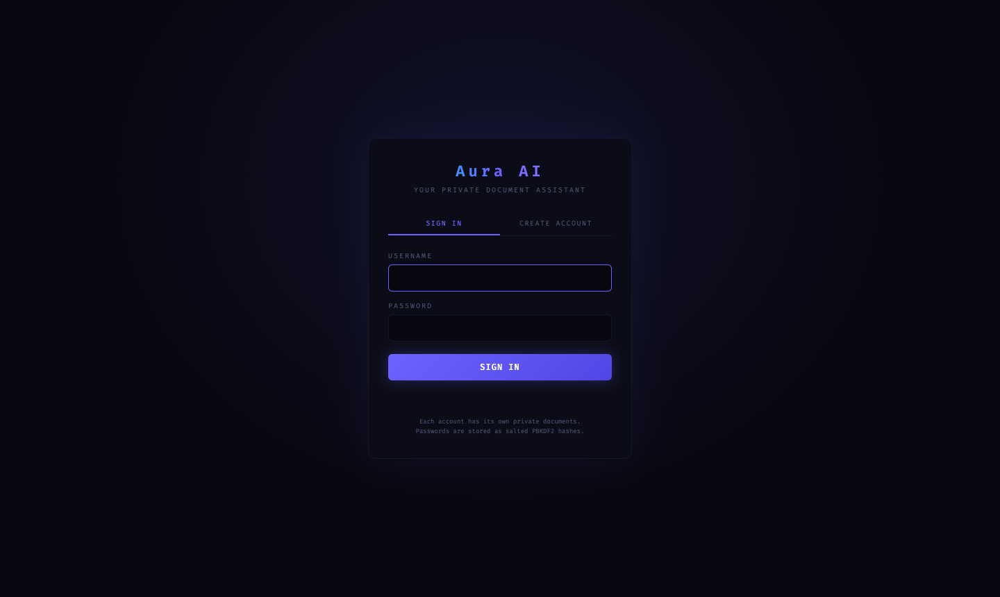
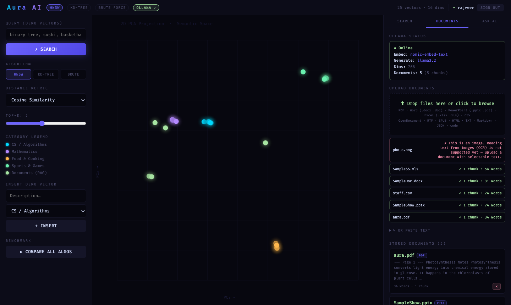
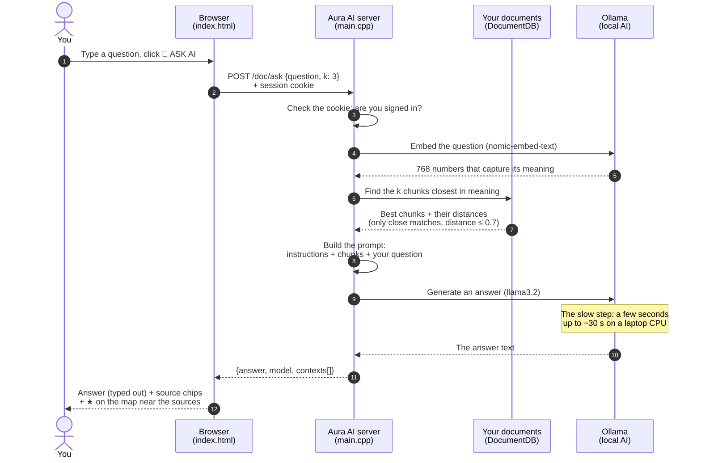
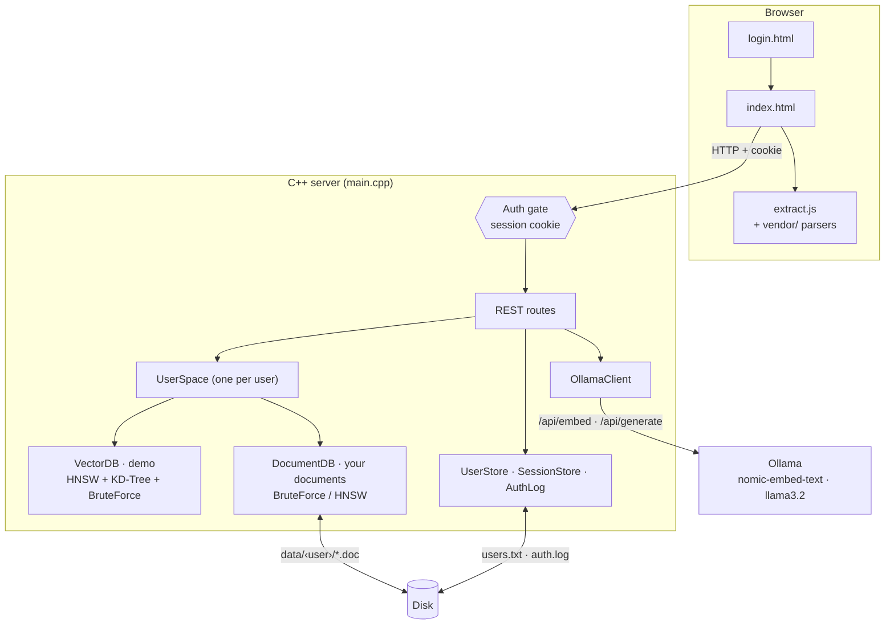

# Aura AI

**Your own private AI assistant. It answers questions from your documents and runs entirely on your computer.**

Aura AI is a **vector database written from scratch in C++** with a web interface and a **RAG (Retrieval-Augmented Generation)** pipeline. Upload PDFs, Word files, PowerPoints, spreadsheets and more, then ask questions about them. A local AI model (via [Ollama](https://ollama.com)) finds the relevant passages and answers. No cloud service is involved and no document ever leaves your machine.

It is also a hands-on way to see how production vector databases such as Pinecone, Weaviate or Chroma work under the hood. Three nearest-neighbour search algorithms (**HNSW**, **KD-Tree**, **Brute Force**) run side by side on a live, visual map of "semantic space".



---

## Table of contents

1. [Features](#features)
2. [How it works](#how-it-works)
3. [Quick start (macOS)](#quick-start-macos)
4. [Installation in detail](#installation-in-detail)
5. [Running Aura AI](#running-aura-ai)
6. [Using the app](#using-the-app)
7. [Accounts & security](#accounts--security)
8. [Where your data is stored](#where-your-data-is-stored)
9. [Configuration](#configuration)
10. [REST API](#rest-api)
11. [Project structure](#project-structure)
12. [Architecture](#architecture)
13. [Algorithms explained](#algorithms-explained)
14. [Troubleshooting](#troubleshooting)
15. [Limitations & roadmap](#limitations--roadmap)
16. [Credits & license](#credits--license)

---

## Features

| | Feature | What it means |
|---|---|---|
| 📄 | **Upload almost any document** | PDF, Word (`.docx`, `.doc`), PowerPoint (`.pptx`, `.ppt`), Excel (`.xlsx`, `.xls`), CSV, OpenDocument, RTF, EPUB, HTML, Markdown, plain text and source code. Drag and drop many files at once. |
| 🤖 | **Ask questions about your documents** | A local LLM (`llama3.2`) answers using the most relevant passages and shows exactly which ones it used. |
| 🔒 | **Private & offline** | Text is extracted in your browser, embedded and answered by models running on your machine. Works without internet once installed. |
| 👤 | **User accounts** | Sign in / create account. Each user has their own private documents. Passwords are stored as salted PBKDF2 hashes, and 5 failed logins lock an account for 15 minutes. |
| 📝 | **Sign-in activity log** | Every sign-up, login, failed attempt, lockout and sign-out is recorded with time and IP address. |
| 💾 | **Documents are saved** | Uploaded documents and their embeddings are stored on disk and come back after a restart, without re-processing. |
| 🔍 | **3 search algorithms** | HNSW (what production vector DBs use), KD-Tree and Brute Force. Run them side by side and compare their speed. |
| 📐 | **3 distance metrics** | Cosine, Euclidean and Manhattan. |
| 🗺️ | **Live semantic map** | A 2-D PCA scatter plot of the vector space. Watch similar items cluster together, and see your query land among its nearest neighbours. |
| 🔌 | **REST API** | Everything the UI does is available over HTTP. |

---

## How it works



1. **Extract.** When you upload a file, your browser reads its text (PDF pages, Word paragraphs, slides, spreadsheet rows…).
2. **Chunk.** The server splits long text into overlapping pieces of about 250 words, so each piece is about one topic.
3. **Embed.** Each chunk is turned into an **embedding**: a list of 768 numbers that captures its *meaning*. Texts about similar things get similar numbers.
4. **Store.** The embeddings go into the vector database (and onto disk).
5. **Retrieve.** When you ask a question, the question is embedded too, and the database finds the chunks whose embeddings are **closest** to it (*nearest-neighbour search*).
6. **Generate.** Those chunks are given to the language model as context, and it writes the answer. The app shows which chunks were used.

This is **RAG (Retrieval-Augmented Generation)**. The AI answers from *your* documents instead of only from what it memorised during training.

---

## Quick start (macOS)

Already have Xcode Command Line Tools and Ollama? Then this is all:

```bash
# 1. Get the AI models (one time, ~2.3 GB)
ollama pull nomic-embed-text
ollama pull llama3.2

# 2. Get the code and build the server (~10 s)
git clone https://github.com/Rajveer-Singh-103900/Your-OWN-AI.git
cd Your-OWN-AI
clang++ -std=c++17 -O2 main.cpp -o db

# 3. Run it
./db
```

Open **http://localhost:8080**, click **CREATE ACCOUNT**, and start uploading documents.

---

## Installation in detail

### What you need

| Requirement | Why | Size |
|---|---|---|
| A C++17 compiler | Builds the server (`clang++` on macOS, `g++` on Windows/Linux) | — |
| [Ollama](https://ollama.com) | Runs the AI models locally | ~500 MB |
| `nomic-embed-text` model | Turns text into embeddings | ~274 MB |
| `llama3.2` model | Writes the answers | ~2 GB |
| A modern browser | Chrome, Edge, Firefox or Safari | — |
| ~8 GB RAM recommended | The models use about 3 GB while running | — |

Everything else (the HTTP server library and the document-reading libraries) is already included in the repository.

### macOS

1. **Install the compiler.** Open Terminal and run:
   ```bash
   xcode-select --install
   ```
   Check it: `clang++ --version`
2. **Install Ollama** from **https://ollama.com/download** and open it once. It then runs in the menu bar.
3. **Download the models:**
   ```bash
   ollama pull nomic-embed-text
   ollama pull llama3.2
   ollama list          # both should be listed
   ```
4. **Get the code and build:**
   ```bash
   git clone https://github.com/Rajveer-Singh-103900/Your-OWN-AI.git
   cd Your-OWN-AI
   clang++ -std=c++17 -O2 main.cpp -o db
   ```
   This creates the server program `db` in about 10 seconds.

### Windows

> Aura AI is developed and tested on macOS. The Windows and Linux steps use each platform's standard toolchain. If something doesn't build, please open an issue.

1. **Install MSYS2 (the g++ compiler)**
   - Download and run the installer from **https://www.msys2.org** (keep the default path `C:\msys64`).
   - Open **MSYS2 UCRT64** from the Start menu and run:
     ```bash
     pacman -Syu
     pacman -S mingw-w64-ucrt-x86_64-gcc
     ```
     (Close and reopen the terminal if `pacman -Syu` asks you to.)
   - Add `C:\msys64\ucrt64\bin` to your Windows **PATH**: press `Win + R`, type `sysdm.cpl`, then go to **Advanced → Environment Variables → Path → Edit → New**.
   - Open a **new** PowerShell and check: `g++ --version`
2. **Install Git** from **https://git-scm.com/download/win** (default settings).
3. **Install Ollama** from **https://ollama.com** (it runs in the system tray), then in PowerShell:
   ```powershell
   ollama pull nomic-embed-text
   ollama pull llama3.2
   ```
4. **Get the code and build:**
   ```powershell
   git clone https://github.com/Rajveer-Singh-103900/Your-OWN-AI.git
   cd Your-OWN-AI
   g++ -std=c++17 -O2 main.cpp -o db -lws2_32
   ```
   This creates `db.exe`.

### Linux

Install `g++` (e.g. `sudo apt install g++`) and Ollama (`curl -fsSL https://ollama.com/install.sh | sh`), pull the two models as above, then:

```bash
g++ -std=c++17 -O2 main.cpp -o db -pthread
```

---

## Running Aura AI

1. **Make sure Ollama is running.** On macOS and Windows it runs in the menu bar or tray after you open it once. Otherwise start it in a terminal with `ollama serve`.
2. **Start the server from the project folder** (it serves the web pages from there):
   ```bash
   cd Your-OWN-AI
   ./db              # Windows: .\db.exe
   ```
   You should see:
   ```
   === Aura AI · VectorDB Engine ===
   http://localhost:8080   (this computer only)
   16D demo vectors | HNSW+KD-Tree+BruteForce | 0 registered user(s)
   Ollama: ONLINE
     embed model: nomic-embed-text  gen model: llama3.2
   ```
   Keep this terminal open. It also shows sign-in activity. Press **Ctrl + C** to stop the server.
3. **Open http://localhost:8080** in your browser.

### Command-line options

| Command | What it does |
|---|---|
| `./db` | Start on port 8080, reachable **only from this computer** |
| `./db 8090` | Use a different port |
| `./db --lan` | Also allow other devices on your network (e.g. your phone at `http://<your-computer-ip>:8080`) |
| `./db 8090 --lan` | Both |

> **After changing the code**, rebuild **and restart** the server (Ctrl + C, then `./db`). A server that is still running keeps using the old program.

---

## Using the app

### 1. Sign in



The first time, click **CREATE ACCOUNT** and choose:
- a **username**: 3–32 characters, letters, digits and `_ . -`
- a **password**: at least 8 characters

You are signed in straight away and stay signed in for 7 days (or until the server restarts). Your name and a **SIGN OUT** button appear in the top-right corner.

### 2. Documents tab: add your knowledge



- **Drag and drop files** onto the upload box, or click it to choose files. You can add many at once.
- Each file shows its progress (*Reading page 3/12…*, *Embedding ~40 chunks…*) and then the result (*✓ 12 chunks · 2,431 words*), or a clear reason why it couldn't be read.
- **✎ OR PASTE TEXT** lets you paste notes directly instead of uploading a file.
- **Stored documents** lists everything you've added. The ✕ button deletes a document completely.
- A file with the same name as a stored document is refused. Delete the old one first.
- The **Ollama status** box shows whether the AI models are available.

#### Supported formats

| Type | Extensions | Notes |
|---|---|---|
| PDF | `.pdf` | Needs selectable text. Page numbers are kept. |
| Word | `.docx`, `.doc` | Old Word 97–2003 `.doc` files work too. |
| PowerPoint | `.pptx`, `.ppt` | Slide text and speaker notes, slide by slide. |
| Spreadsheets | `.xlsx`, `.xls`, `.xlsb`, `.ods`, `.csv`, `.tsv` | Every sheet. Each row is stored as `Column: value \| Column: value`, so answers keep their context. |
| OpenDocument | `.odt`, `.odp`, `.ods` | LibreOffice / OpenOffice files. |
| Other documents | `.rtf`, `.epub`, `.html`, `.xml` | |
| Text | `.txt`, `.md`, `.json`, `.log`, source code, … | Any text file (UTF-8, UTF-16 or Windows-1252). |

The file type is detected from the file's **content**, not just its name, so a renamed file (e.g. a `.docx` saved as `.doc`) still works.

**Not supported yet** (you get a clear message instead): scanned PDFs and images (these need OCR), password-protected files, Apple Pages/Keynote files (export them to PDF or Word first), audio/video, and `.zip` archives (unzip them first). One document can be up to about 440,000 words.

### 3. Ask AI tab: ask questions

1. Type a question about your documents. Press **Ctrl + Enter** or click **🤖 ASK AI**.
2. Choose how many passages to use (**Top 2 / 3 / 5**).
3. The answer appears with the model name and the **retrieved context**: chips like `#1 report.pdf [3/12] · 0.217`. Click a chip to read the exact passage. The number is the *distance*: smaller means more similar.
4. On the map, a ★ marks your question and lines connect it to the documents that were used.

The AI uses your documents when they contain relevant information, and otherwise answers from its general knowledge. Answers take a few seconds up to ~30 s on a laptop CPU.

#### What happens when you click ASK AI



Every step runs on your computer. Only you can see your documents: the server searches the signed-in user's documents and nobody else's.

### 4. Search tab & the semantic map: see how vector search works

This part is a small, visual **demo** of vector search, using 20 built-in example items in 4 categories (CS, Math, Food, Sports). Each item has 16 dimensions, 4 per category.

- **Search:** type a concept (`binary tree`, `sushi`, `calculus`, `basketball`), choose an **algorithm** and a **distance metric**, and click **⚡ SEARCH**. Results show their distance, the matches glow on the map, and the search latency is shown in µs.
- **▶ COMPARE ALL ALGOS** times HNSW, KD-Tree and Brute Force on the same query.
- **HNSW graph layers** shows how many nodes and edges each layer of the HNSW graph has.
- **Insert demo vector** adds your own item to the demo set.
- **The map** is a 2-D projection (PCA) of all vectors. Items with similar meaning form clusters. Your uploaded documents appear as green dots.

> In this demo the query text is turned into a vector with a simple keyword matcher in the browser, so you can see the algorithms at work without the AI. Your real documents use the real `nomic-embed-text` model (768 dimensions).

---

## Accounts & security

| Protection | How |
|---|---|
| **Everything requires sign-in** | Every page, file and API endpoint except the sign-in page returns *401 Not signed in* (or redirects to `/login`) without a valid session. |
| **Passwords are never stored** | Only a salted **PBKDF2-HMAC-SHA256** hash (200,000 rounds, random 16-byte salt per user) is saved. Checking a password takes ~0.3 s on purpose, which makes guessing slow. |
| **Brute-force lockout** | 5 wrong passwords lock that username for 15 minutes, even for the correct password. Other users are unaffected. |
| **No username guessing** | The error is always "Invalid username or password", and unknown usernames take exactly as long to check as real ones. |
| **Secure sessions** | A random 256-bit token in a cookie with `HttpOnly` (JavaScript can't read it) and `SameSite=Strict` (other websites can't use it). Sign-out ends it immediately. |
| **Private data per user** | Each account has its own documents and demo map. Users can't see, search or delete each other's data. |
| **Local by default** | The server only accepts connections from your own computer unless you start it with `--lan`. |
| **Safe display** | Document text is always shown as text, never as HTML, so a malicious file can't run code in the page. |

### Sign-in activity log

Every sign-in event is printed in the server's terminal and appended to **`auth.log`**:

```
2026-09-29 14:02:11  SIGNUP         priya            127.0.0.1        new account, signed in
2026-09-29 14:05:02  LOGIN OK       priya            127.0.0.1
2026-09-29 14:05:40  LOGIN FAILED   bob              127.0.0.1        wrong password (2/5)
2026-09-29 14:06:12  LOGIN FAILED   ghost            127.0.0.1        no such user (1/5)
2026-09-29 14:07:30  LOCKED         bob              127.0.0.1        too many failures, locked for 15 min
2026-09-29 14:07:41  LOGIN BLOCKED  bob              127.0.0.1        account is locked
2026-09-29 14:09:03  LOGOUT         priya            127.0.0.1
```

| To see… | Run (in the project folder) |
|---|---|
| the whole history | `cat auth.log` |
| new events live | `tail -f auth.log` (Ctrl + C to stop) |
| all registered accounts | `cut -d' ' -f1 users.txt` |

Usernames in the log are cleaned (printable characters only, max 40), so nobody can forge log lines by typing a strange username.

---

## Where your data is stored

Everything lives in the project folder, on your computer only. These files are **never committed to git**.

| Path | Contents | Created |
|---|---|---|
| `users.txt` | One line per account: username + password hash (never the password) | on the first sign-up |
| `data/<username>/` | That user's documents: one `.doc` file per document with its text chunks and embeddings | on the user's first upload |
| `auth.log` | Sign-in activity log | on the first sign-in event |

- **Restarting the server** keeps accounts and documents. Everyone just signs in again.
- **Remove all accounts:** delete `users.txt`.
- **Remove one user's documents:** delete `data/<username>/`.
- **Forgot a password:** delete that user's line in `users.txt` and create the account again with the same username. Their documents in `data/<username>/` come back.
- On macOS and Linux these files are readable only by your own user account.

---

## Configuration

Most settings are constants in `main.cpp`. Change them, rebuild, and restart.

| Setting | Default | Where |
|---|---|---|
| Port / network access | `8080`, this computer only | command line: `./db [port] [--lan]` |
| Embedding model | `nomic-embed-text` | `OllamaClient::embedModel` |
| Answer model | `llama3.2` | `OllamaClient::genModel` |
| Ollama address | `127.0.0.1:11434` | `OllamaClient` constructor |
| Chunk size / overlap | 250 / 30 words | `chunkText(text, 250, 30)` in `/doc/insert` |
| Max. chunks per document | 2,000 (~440k words) | `MAX_DOC_CHUNKS` |
| Relevance cut-off | cosine distance ≤ 0.7 | `DocumentDB::search` (`max_dist`) |
| Exact search up to | 20,000 chunks per user (HNSW above) | `EXACT_SEARCH_MAX` |
| Password hashing | PBKDF2-SHA256, 200,000 rounds | `UserStore::ITERATIONS` |
| Lockout | 5 failures → 15 minutes | `UserStore::MAX_FAILS`, `LOCK_MINUTES` |
| Session length | 7 days, renewed on use | `SessionStore::TTL_HOURS` |

**Faster answers on a slow laptop:** run `ollama pull llama3.2:1b` and set `genModel = "llama3.2:1b"`.

If you change the **embedding** model, documents embedded with the old model are skipped at start-up with a warning, because their vectors aren't comparable. Upload them again.

---

## REST API

All endpoints are at `http://localhost:8080`. Request bodies are JSON. Errors are returned as `{"error": "..."}`.
Every endpoint except `/login` and `/auth/*` needs a signed-in session cookie. Without one it returns `401`.

### Authentication

| Method | Endpoint | Body | Result |
|---|---|---|---|
| `POST` | `/auth/register` | `{"username","password"}` | Creates the account and signs in (sets cookie). `400` invalid, `409` taken. |
| `POST` | `/auth/login` | `{"username","password"}` | Signs in (sets cookie). `401` wrong credentials, `429` locked. |
| `POST` | `/auth/logout` | — | Ends the session. |
| `GET` | `/auth/me` | — | `{"username": "..."}` |

### Documents & RAG

| Method | Endpoint | Body | Result |
|---|---|---|---|
| `POST` | `/doc/insert` | `{"title","text","kind"?,"map"?}` | Chunks, embeds, saves and stores a document (all-or-nothing). Returns `{docId, chunks, words, dims}`. `409` duplicate title, `413` too large, `503` Ollama unavailable. |
| `GET` | `/doc/list` | — | Your documents: `docId, title, kind, chunks, words, preview` |
| `DELETE` | `/doc/delete/:docId` | — | Deletes a whole document |
| `POST` | `/doc/search` | `{"question","k"?}` | Most similar chunks only (no LLM) |
| `POST` | `/doc/ask` | `{"question","k"?}` | Full RAG: `{answer, model, contexts[], docCount}` |
| `GET` | `/status` | — | Ollama status, models, document/chunk counts |

`kind` is a label such as `"PDF"`. `map` is an optional 16-number position on the demo map. `k` is 1–10 (default 3).

### Demo vector search

| Method | Endpoint | Result |
|---|---|---|
| `GET` | `/search?v=<16 comma-separated numbers>&k=5&metric=cosine&algo=hnsw` | k nearest demo vectors + latency. `metric`: `cosine`/`euclidean`/`manhattan`. `algo`: `hnsw`/`kdtree`/`bruteforce`. |
| `GET` | `/benchmark?v=...&k=5&metric=cosine` | Time of each algorithm in µs |
| `POST` | `/insert` | Add a demo vector: `{"metadata","category","embedding":[16 numbers]}` |
| `DELETE` | `/delete/:id` | Remove a demo vector |
| `GET` | `/items` | All demo vectors |
| `GET` | `/hnsw-info` | HNSW layers, nodes and edges |
| `GET` | `/stats` | Count, dimensions, algorithms, metrics |

### Example with curl

```bash
# Sign in and keep the session cookie in cookies.txt
curl -c cookies.txt -X POST http://localhost:8080/auth/login \
     -H 'Content-Type: application/json' \
     -d '{"username":"priya","password":"my-password"}'

# Add a document
curl -b cookies.txt -X POST http://localhost:8080/doc/insert \
     -H 'Content-Type: application/json' \
     -d '{"title":"notes.txt","text":"The mitochondria is the powerhouse of the cell."}'

# Ask a question
curl -b cookies.txt -X POST http://localhost:8080/doc/ask \
     -H 'Content-Type: application/json' \
     -d '{"question":"What is the powerhouse of the cell?"}'
```

---

## Project structure

```
Your-OWN-AI/
├── main.cpp            C++ server: vector indexes, databases, Ollama client, accounts, REST API
├── index.html          The app: search demo, semantic map, documents, Ask AI (HTML + CSS + JS)
├── login.html          Sign-in / create-account page
├── extract.js          Reads text out of uploaded files, in the browser
├── httplib.h           cpp-httplib: single-header HTTP server (third-party)
├── vendor/             Third-party document readers used by extract.js
│   ├── pdf.min.js, pdf.worker.min.js   pdf.js: PDF
│   ├── mammoth.browser.min.js          mammoth: Word .docx
│   ├── xlsx.full.min.js                SheetJS: spreadsheets + old Office file container
│   └── jszip.min.js                    JSZip: PowerPoint, OpenDocument, EPUB
├── docs/screenshots/   Images used in this README
└── README.md

Created at runtime (not in git):
├── db / db.exe         The compiled server
├── users.txt           Accounts (password hashes)
├── auth.log            Sign-in activity log
└── data/<username>/    Saved documents
```

There is no build system, framework or package manager: one C++ file, one compiler command, and plain HTML/JavaScript.

---

## Architecture



| Component (in `main.cpp`) | Role |
|---|---|
| `BruteForce`, `KDTree`, `HNSW` | The three nearest-neighbour indexes |
| `VectorDB` | The 16-D demo database. Every item is in all three indexes so they can be compared. |
| `DocumentDB` | Your documents: chunks, 768-D embeddings, search, and saving to / loading from `data/<user>/` |
| `UserSpace` | One `VectorDB` + one `DocumentDB` per signed-in user, loaded on first use |
| `OllamaClient` | Talks to Ollama: batch embeddings (`/api/embed`, 32 chunks per call) and answers (`/api/generate`) |
| `UserStore` | Accounts in `users.txt`, PBKDF2 hashing, lockout |
| `SessionStore` | Signed-in sessions (random tokens, in memory) |
| `AuthLog` | The sign-in activity log |
| `chunkText` | Splits text into overlapping 250-word chunks |
| Auth gate | Runs before every request and lets only signed-in users through |

**The document pipeline in detail:**

1. `extract.js` detects the real file type from its bytes and extracts text with the matching reader. It uses pdf.js, mammoth, SheetJS and JSZip, plus small custom readers for old `.doc`/`.ppt` files and RTF. Output is Unicode-normalised, so, for example, PDF ligatures like "fi" become "fi".
2. The browser sends `{title, text, kind, map}` to `POST /doc/insert`.
3. The server chunks the text and embeds all chunks in batches. **Only if every chunk succeeds** is the document written to disk and added to the index, so a failed upload never leaves half a document behind.
4. `POST /doc/ask` embeds the question, retrieves the top-k chunks (cosine distance ≤ 0.7), builds a prompt with them, and asks `llama3.2`.

---

## Algorithms explained

### Distance metrics

| Metric | Formula (idea) | Good for |
|---|---|---|
| **Cosine** | 1 − cos(angle between the vectors) | Text embeddings: compares *direction* (meaning), not length |
| **Euclidean** | straight-line distance | Geometric data |
| **Manhattan** | sum of absolute differences | Grid-like data, robust to outliers |

### Brute Force: O(N·d)
Compare the query with every vector and sort. Always exact, and the baseline the others are measured against.

### KD-Tree: about O(log N) in low dimensions
A binary tree that splits space along one dimension at a time (cycling through them). During search, whole branches are skipped when they can't contain anything closer than the best match so far. Very fast at low dimensions, but it degrades towards brute force as dimensions grow (the "curse of dimensionality"). At 768 dimensions almost nothing can be skipped.

### HNSW (Hierarchical Navigable Small World): about O(log N)
The algorithm behind Pinecone, Weaviate, Chroma and Milvus. Vectors are nodes in a **multi-layer graph**: the top layers are sparse "highways" with long links, and the bottom layer has every node with short links.

- **Insert:** each node gets a random top layer. Starting at the top, greedily walk to the closest node, go down a layer, and repeat. On each layer the new node is linked to its nearest neighbours (M = 16, 32 on the bottom layer, found with a beam search of width 200).
- **Search:** the same greedy descent, then a wider beam search (ef = 50) on the bottom layer.
- **Why it's fast:** the upper layers get you to the right neighbourhood in a few hops, and the bottom layer refines the result.

HNSW is **approximate**: it trades a little accuracy for a lot of speed. While testing Aura AI we found that this simple HNSW version could miss an "odd one out" chunk, often exactly the chunk holding a specific fact. **Document search therefore uses exact brute-force search up to 20,000 chunks per user** (a few milliseconds at that size) and switches to HNSW above that. The Search tab still lets you compare all three algorithms.

---

## Troubleshooting

| Problem | Solution |
|---|---|
| Browser shows *This site can't be reached* | The server isn't running. Start it with `./db` **from the project folder**. |
| Blank page or *404* | You started `./db` from another folder. `cd` into `Your-OWN-AI` first. |
| Header shows **OLLAMA ✗** | Open the Ollama app, or run `ollama serve`. |
| *Ollama model '…' is missing* | Run `ollama pull nomic-embed-text` and `ollama pull llama3.2`. |
| *The document reader did not load* | An old server is still running from before an update. Stop it (Ctrl + C) and start `./db` again, then refresh with Cmd/Ctrl + Shift + R. |
| Changes to the code don't show up | Rebuild **and** restart the server, then hard-refresh the browser. |
| *could not listen on port 8080* | Something else uses the port. Stop it (macOS/Linux: `lsof -ti :8080 \| xargs kill`; Windows: `netstat -ano \| findstr 8080`, then `taskkill /PID <pid> /F`) or use `./db 8090`. |
| *Too many failed attempts* | Wait 15 minutes, or restart the server (lockouts are kept in memory). |
| Forgot password | Delete the user's line in `users.txt` and sign up again with the same username. Documents are kept. |
| *This PDF has no selectable text* | It's a scanned PDF (images). OCR isn't supported yet. |
| First upload is slow | Ollama loads the model on first use. Wait a moment. |
| Answers take 10–30 s | Normal on a laptop CPU. Use `llama3.2:1b` for faster answers (see [Configuration](#configuration)). |
| `g++: command not found` (Windows) | Add `C:\msys64\ucrt64\bin` to PATH and open a new terminal. |
| `undefined reference to WSA…` (Windows) | Add `-lws2_32` to the build command. |

---

## Limitations & roadmap

**Current limitations**
- Scanned PDFs and images can't be read yet (no OCR).
- Password-protected files, Apple Pages/Keynote, audio/video and archives aren't supported.
- There is no "forgot password" flow, account deletion or admin page. Anyone who can reach the server can create an account, which is why the server is local-only by default.
- It serves plain HTTP. That's fine on your own computer, but exposing it to the internet would need HTTPS.
- Sessions and lockouts are kept in memory, so everyone signs in again after a restart.
- Demo vectors you insert by hand in the Search tab are not saved.
- The HNSW implementation uses simple neighbour selection. The improved heuristic from the HNSW paper would make it reliable enough for document search at every size.

**Ideas for the future**
- OCR for scanned PDFs and images
- An admin page: accounts, who is signed in, recent activity
- Streaming answers token by token
- Improved HNSW neighbour selection
- Hosting with HTTPS for access from anywhere

---

## Credits & license

Built with:
- [cpp-httplib](https://github.com/yhirose/cpp-httplib) (MIT): HTTP server
- [Ollama](https://ollama.com) with [nomic-embed-text](https://ollama.com/library/nomic-embed-text) and [Llama 3.2](https://ollama.com/library/llama3.2): local AI models
- [pdf.js](https://mozilla.github.io/pdf.js/) (Apache-2.0), [mammoth.js](https://github.com/mwilliamson/mammoth.js) (BSD-2-Clause), [SheetJS](https://sheetjs.com) (Apache-2.0), [JSZip](https://stuk.github.io/jszip/) (MIT/GPLv3): document readers
- [Fira Code](https://github.com/tonsky/FiraCode) font

The Aura AI source code is released under the **MIT License**. Use it however you like.
